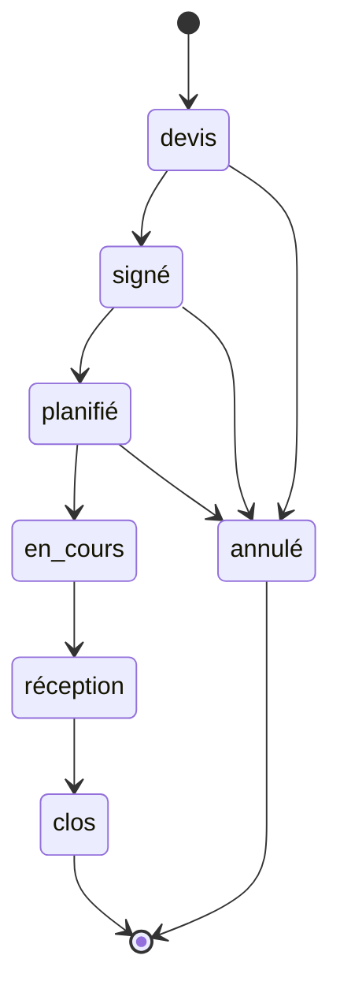
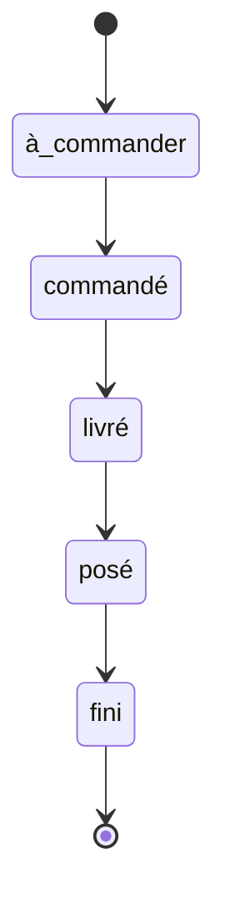

# Cycle de vie du chantier

Livrable semaine 1 · 3 octobre 2026 · Kerguelenn

Le produit suit les chantiers de rénovation d'une entreprise du BTP, de la signature du devis à la levée des réserves, et coordonne l'équipe avec les externes (client, architecte, ingénieur, syndic, fournisseur). Sujet jumeau dans le flux de nuit : `chantiers`.

## Les rôles

| Rôle | Qui | Accès |
| --- | --- | --- |
| Gérant | le patron | tout ; gère les comptes et les invitations ; alerté aux étapes devis, signé, réception, annulé |
| Équipe | les chefs d'équipe | toutes les étapes, sur les chantiers où ils sont participants |
| Externe | client, architecte, ingénieur, syndic, fournisseur | ses seuls chantiers, et seulement ce qu'on lui partage ; ne change jamais un statut |

La qualité d'un externe (client, syndic…) est un libellé rangé sur l'invitation, pas un rôle. Elle ne donne aucun droit.

Tout accès à un chantier passe par la table des participants. Un réglage, « l'équipe voit tous les chantiers », ajoute chaque membre de l'équipe à chaque chantier : actif pour une petite entreprise, désactivé pour une grande.

## Le chantier

| Transition | Qui | Condition | Alerte au gérant |
| --- | --- | --- | --- |
| création → devis | gérant, équipe | client et adresse renseignés | oui |
| devis → signé | gérant, équipe | devis joint au fil | oui |
| signé → planifié | gérant, équipe | date de début, au moins un lot | non |
| planifié → en cours | gérant, équipe | date de début atteinte | non |
| en cours → réception | gérant, équipe | **tous les lots sont finis** | oui |
| réception → clos | gérant, équipe | **aucun signalement à qualifier, aucune réserve ouverte** | non |
| devis, signé, planifié → annulé | gérant, équipe | motif obligatoire ; impossible une fois en cours | oui |

## Le lot

Un chantier se découpe en lots (carrelage, électricité, menuiseries…). Chaque lot a une date de livraison prévue et une date de fin prévue.

| Transition | Qui | Condition |
| --- | --- | --- |
| à commander → commandé | gérant, équipe | fournisseur choisi parmi les participants |
| commandé → livré | gérant, équipe | — |
| livré → posé | gérant, équipe | **le lot a été livré** |
| posé → fini | gérant, équipe | — |

Un lot est en retard quand une date prévue est dépassée sans que l'étape ait eu lieu. Le produit le calcule, personne ne le déclare.

## Le fil

Un seul fil par chantier. Chaque apport a un auteur parmi les participants, vise parfois un lot, et porte un type.

| Type | Ce que c'est | Qui peut le créer |
| --- | --- | --- |
| demande | quelque chose qu'un participant doit rendre, avec un destinataire et une date | gérant, équipe |
| réponse | la réponse à une demande | tous |
| disponibilité | un créneau où le participant est présent | tous |
| document | un fichier : devis, plan, procès-verbal, photo | tous |
| signalement | une anomalie constatée | tous |

**Qui voit quoi.** Tout élément du fil, quel que soit son type, est **interne** par défaut : seuls le gérant et l'équipe le voient. Pour le montrer à des externes, le gérant ou un chef d'équipe ouvre la fenêtre « Qui voit ça ? » et coche, un par un, les participants du chantier qui le verront. Rien n'est réservé en dur à une qualité : le devis se partage au client en le cochant, pas parce qu'il est client. Deux réglages par défaut seulement :
- une demande adressée à un externe arrive déjà cochée pour lui (on peut le décocher) ;
- ce qu'écrit un externe est vu par son auteur, le gérant et l'équipe ; l'équipe peut ensuite le partager à d'autres.

Un signalement suit son propre statut : `à qualifier` → `réserve ouverte` → `levée`, ou `à qualifier` → `écarté` avec un motif. Seuls le gérant et l'équipe qualifient, lèvent ou écartent.

## Les règles

1. **Pas de clôture** tant qu'un signalement est à qualifier ou qu'une réserve est ouverte. C'est la règle testée :
   - cas normal : toutes les réserves levées, la clôture passe ;
   - cas vide : aucun signalement jamais fait, la clôture passe ;
   - cas piégé : un client signale une anomalie la veille de la clôture, la clôture est refusée.
2. Pas de pose sans livraison.
3. Pas de réception tant qu'un lot n'est pas fini.
4. Un externe ne voit que ses chantiers, et dans le fil seulement ce qui a été coché pour lui.
5. Les montants, les lots et leurs retards sont internes : un externe ne les voit jamais à l'écran. Pour l'informer d'un retard, l'équipe lui écrit dans le fil et coche son nom.
6. Un fournisseur dont l'établissement est fermé (Sirene) ne peut pas être invité.

## Les tables

| Table | Contient | Relié à |
| --- | --- | --- |
| chantiers | adresse, client, statut, dates, **montant HT** (interne), météo | — |
| lots | nom, statut, dates prévues et réelles | un chantier, un fournisseur |
| participants | qui est invité sur quel chantier, à quel titre | un chantier, un compte |
| fil | type, texte, fichier, statut du signalement, **liste des participants qui le voient** | un chantier, parfois un lot, un auteur |

Les comptes sont gérés à part par Auth.js.

## Les API

- **OpenWeatherMap** (clé) : à la création du chantier, l'adresse est géolocalisée par l'API Adresse (sans clé) et la fiche affiche la météo des trois prochains jours. Si l'API ne répond pas, la fiche affiche « météo indisponible ».
- **Sirene** (clé) : à l'invitation d'un fournisseur, son SIRET remplit sa fiche. Si l'API ne répond pas, la saisie reste possible à la main.

## Hors périmètre en semaine 1

- Retards et relances dans le récapitulatif du matin : semaine 2.
- Lecture des courriers fournisseurs : semaine 3.
- Échéancier des paiements et agent coordinateur : semaine 4.
- Plusieurs entreprises dans la même installation : dette assumée. Le jour où ce sera faux, il faudra rattacher chaque donnée à son entreprise.
