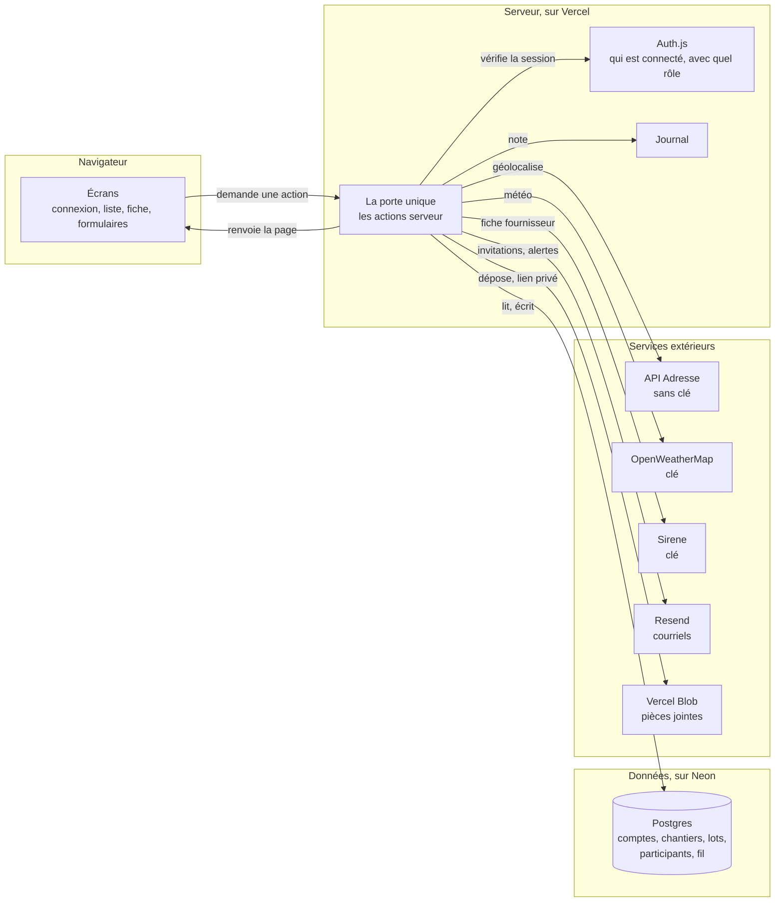
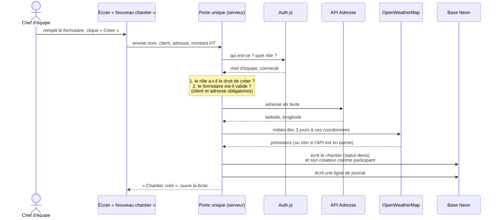

# Schéma du produit

Rendu semaine 1 · 4 octobre 2026 · Kerguelenn

## Les quatre étages

Une seule règle : **le navigateur ne parle jamais directement à la base ni aux services extérieurs.** Il demande, le serveur vérifie et agit. Les clés des services vivent sur le serveur, dans les réglages de Vercel, et n'arrivent jamais dans le navigateur.

## Le trajet d'un clic : créer un chantier

C'est le trajet qu'on explique en démo.

Ce qu'il faut savoir dire, étape par étape :

1. **Le clic** envoie le formulaire au serveur. Le navigateur ne décide de rien.
2. **Le serveur demande à Auth.js qui est connecté.** Le rôle vient de la session, jamais du formulaire : un utilisateur ne peut pas se déclarer gérant.
3. **Deux vérifications** : ce rôle a-t-il le droit de créer un chantier ? Le formulaire est-il complet et valide ? Un refus s'arrête là, avec un message, et rien n'est écrit.
4. **L'enrichissement.** L'adresse devient des coordonnées, puis une météo. Si l'un des deux services ne répond pas, le chantier est créé quand même : la fiche affichera « météo indisponible ».
5. **L'écriture.** Le chantier entre en base au statut `devis`, et son créateur y devient participant. Sans cela, il ne pourrait pas le revoir.
6. **Le journal** garde une ligne : qui a créé quel chantier, quand.
7. **La réponse** : le message « Chantier créé » et la fiche s'ouvre.

## Une tentative refusée

Même porte, autre issue. Un externe tape l'adresse d'un chantier où il n'est pas invité. Le serveur reconnaît la personne grâce à Auth.js, ne la trouve pas parmi les participants de ce chantier, répond « Chantier introuvable » et écrit `acces_refuse` dans le journal. C'est cette ligne qu'on retrouve en démo dans les journaux Vercel.

## Où vit quoi

| Étage | Service | Ce qu'il garde |
| --- | --- | --- |
| Code | GitHub, `ElahTovim/groma` | le code et son historique, une branche par fonctionnalité |
| Serveur | Vercel, `gromaa.vercel.app` | les écrans, la porte unique, les clés (variables d'environnement), les journaux |
| Données | Neon, `groma-db` | les comptes, les chantiers, les lots, les participants, le fil |
| Fichiers | Vercel Blob | les pièces jointes, servies par un lien privé |
| Surveillance | UptimeRobot, Sentry | la disponibilité du site, les erreurs |
